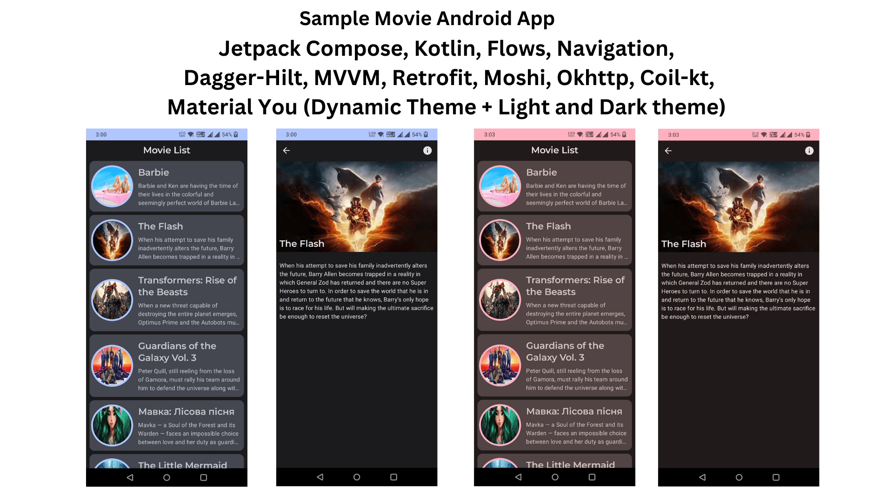

# Movie App 

**Movie App** is a sample movie listing Android application 📱 built to demonstrate use of *Modern Android development* tools like Jetpack Compose and Kotlin Flows.

## About
It simply loads **Movies** data from [TMDB API](https://www.themoviedb.org/)  and shows as a list using LazyColumn.
- User can click on a movie to navigate to Movie Detail screen.
- Clean and Simple Material UI.
- It supports dark theme and dynamic theme (based on wallpaper) too 🌗.

## Built With 🛠
- [Kotlin](https://kotlinlang.org/) - First class and official programming language for Android development.
- [Jetpack Compose](https://developer.android.com/jetpack/compose) - Android’s recommended modern toolkit for building native UI
- [Coroutines](https://kotlinlang.org/docs/reference/coroutines-overview.html) - For asynchronous operations like network calls.
- [Navigation](https://developer.android.com/jetpack/compose/navigation) - Using the Android Navigation component libraries for Jetpack Compose
- [Flow](https://kotlin.github.io/kotlinx.coroutines/kotlinx-coroutines-core/kotlinx.coroutines.flow/-flow/) - StateFlow and MutableStateFlow
- [ViewModel](https://developer.android.com/topic/libraries/architecture/viewmodel) - Stores UI-related data that isn't destroyed on UI changes.
- [Dependency Injection](https://developer.android.com/training/dependency-injection) -
    - [Dagger-Hilt](https://developer.android.com/training/dependency-injection/hilt-android) - Standard library to incorporate dependency injection into an Android application.
- [Retrofit](https://square.github.io/retrofit/) - A type-safe HTTP client.
- [Moshi](https://github.com/square/moshi) - A modern JSON library for Kotlin and Java.
- [Moshi Converter](https://github.com/square/retrofit/tree/master/retrofit-converters/moshi) - A Converter which uses Moshi for serialization to and from JSON.
- [Coil-kt](https://coil-kt.github.io/coil/) - An image loading library for Android backed by Kotlin Coroutines.
- [Material You - Dynamic Theming](https://source.android.com/docs/core/display/material) - Modular and customizable Material Design UI components for Android


## Architecture
This app uses [***MVVM (Model View View-Model)***](https://developer.android.com/jetpack/docs/guide#recommended-app-arch) architecture.

## How to install/run?
- Clone the project
- Get API key from [TMDB](https://www.themoviedb.org/) - it is free.
- Add the API key in local.properties as below
`TMDB_API_KEY="your_key_here"`

## TODO
- Add Tests
- Pagination
- Use Cases (to separate presentation and data layer)

## Contact
If you need any help, you can connect with me.

Visit:- [Linkedin](https://www.linkedin.com/in/inventionsbyhamid/)

## License
```
MIT License

Copyright (c) 2023 Hamid Siddiqui

Permission is hereby granted, free of charge, to any person obtaining a copy
of this software and associated documentation files (the "Software"), to deal
in the Software without restriction, including without limitation the rights
to use, copy, modify, merge, publish, distribute, sublicense, and/or sell
copies of the Software, and to permit persons to whom the Software is
furnished to do so, subject to the following conditions:

The above copyright notice and this permission notice shall be included in all
copies or substantial portions of the Software.

THE SOFTWARE IS PROVIDED "AS IS", WITHOUT WARRANTY OF ANY KIND, EXPRESS OR
IMPLIED, INCLUDING BUT NOT LIMITED TO THE WARRANTIES OF MERCHANTABILITY,
FITNESS FOR A PARTICULAR PURPOSE AND NONINFRINGEMENT. IN NO EVENT SHALL THE
AUTHORS OR COPYRIGHT HOLDERS BE LIABLE FOR ANY CLAIM, DAMAGES OR OTHER
LIABILITY, WHETHER IN AN ACTION OF CONTRACT, TORT OR OTHERWISE, ARISING FROM,
OUT OF OR IN CONNECTION WITH THE SOFTWARE OR THE USE OR OTHER DEALINGS IN THE
SOFTWARE.
```